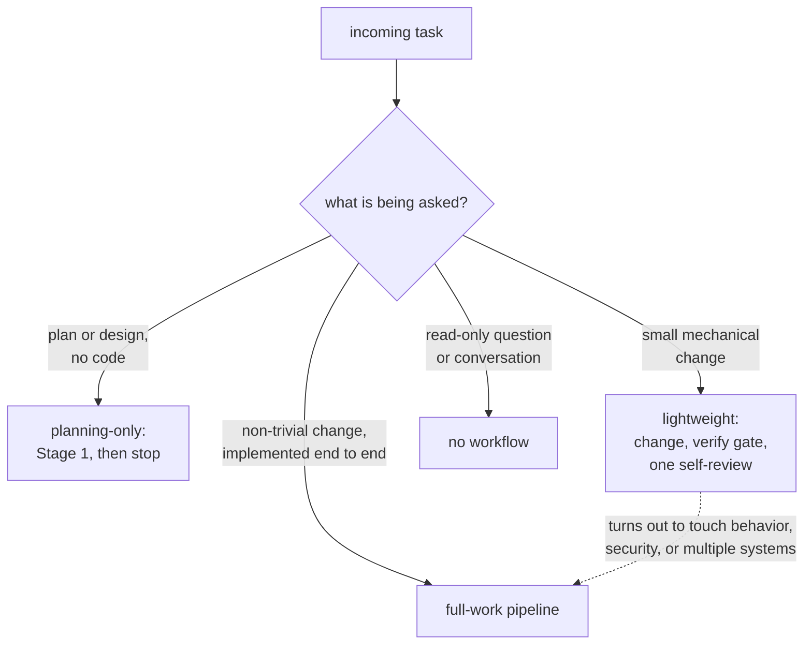
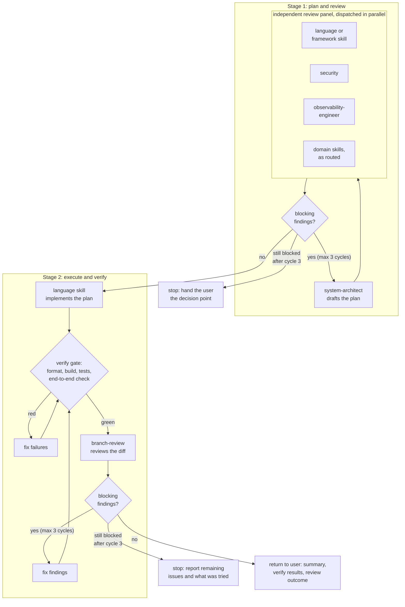
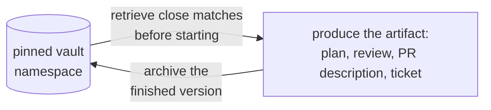

# Claude skill set

My personal skill set for Claude Code: a bootstrap file, a shared knowledge base, a catalog of
per-domain skills, and a set of execution workflows that turn the whole thing into a pipeline. The
skills tell the agent how to write good code in each stack; the workflows decide how a task moves
from prompt to a reviewed, verified result. The workflows are the part you won't find in most skill
collections, so they get the longest section below.

## This is opinionated

These skills encode best practices with specific preferences, not neutral best practice. Some choices are deliberate 
and would be wrong for other people: Rust uses `anyhow` as the sole error crate, C# keeps nullable reference types
disabled (which should be the default, IMO), prose avoids em-dashes and the usual AI vocabulary, plans and reviews get
archived to a personal vault, and tests follow particular naming and structure rules. Treat it as one person's 
calibrated setup.
Fork it and change what doesn't fit you rather than adopting it wholesale.

## How it works

Two `CLAUDE.md` files (one at the repo root, one global) tell the agent to read a short list of foundational
knowledge files at the start of every conversation:

1. `general-problem-solving.md`: reasoning and planning approach
2. `general-remembering-lessons.md`: the cross-project lessons vault protocol
3. `git-readonly-operations.md`: how to use the read-only git MCP
4. `task-workflows.md`: the execution workflows described below
5. `vault-operations.md`: when and how to use the vault MCP
6. `os-doctor-operations.md`: local machine diagnostics via the os-doctor MCP
7. `writing-style.md`: how to write prose that doesn't read as AI-generated

Everything else in `skills/brain/knowledge/` is loaded on demand when a task relates to it. Individual
skills are surfaced by the Claude Code runtime and applied when their domain comes up.

## Execution workflows

Defined in `skills/brain/knowledge/task-workflows.md` and applied to every coding task. Instead of the
agent free-styling from prompt to diff, each task is classified before work starts and routed down one
of four paths:

- **Full-work**: any non-trivial change the user wants implemented end to end. Features, behavior
  changes, anything spanning multiple files or touching security, data, external interfaces, or
  migrations.
- **Planning-only**: the user wants a plan or a design decision, not code. Runs Stage 1 of the
  full-work pipeline and stops there.
- **Lightweight**: a small mechanical change (typo, config tweak, doc edit, rename). Skips the review
  panel; the change still passes the verify gate and gets one focused self-review.
- **None**: read-only questions and conversation run no workflow at all.

Classification isn't final. A task that starts lightweight but turns out to touch behavior or multiple
systems escalates to full-work rather than pushing a large change through the light path.



### The full-work pipeline



**Stage 1: plan and review.** The `system-architect` skill turns the prompt into a plan. That plan then
goes to an independent review panel, dispatched in parallel, where each reviewer reads the same plan
through its own lens:

- the relevant language or framework skill, for technical depth
- `security`, reviewing as a security professional
- `observability-engineer`, recommending a sane level of monitoring and logging
- any domain skill the plan actually touches (`postgres`, `reactjs`, `godot`, and so on), routed by
  what the plan does rather than a fixed list

Findings are consolidated, de-duplicated, and split into **blocking** (correctness, security, data, or
design flaws) and **suggestions**. Blocking findings send the plan back to the architect for revision;
only the lenses whose concerns the revision touched re-review, not the whole panel. Suggestions worth
taking are folded in directly.

**Stage 2: execute and verify.** The language skill implements the approved plan. Before any review
happens, a mandatory verify gate runs: formatter, build or typecheck, the test suite, and an end-to-end
exercise of the change where it has a runtime surface. Review never starts on a red build, because
reviewing unrun code is reviewing a guess. Once the gate is green, `branch-review` reviews the diff.
Blocking findings loop back to a fix, another pass through the verify gate, and a re-review of the
affected areas.

**Loop caps.** Both revision loops are capped at 3 cycles. If blocking issues survive the third cycle,
the pipeline stops and hands the user a real decision point: the specific disagreement, what was tried,
and the trade-off at stake. No infinite plan-review ping-pong.

**Autonomy.** The pipeline runs end to end without pausing for approval between stages or narrating
each skill handoff. It comes back when the work is done (with a summary, the verify results, and the
review outcome) or when a cap is hit.

### Precedent through the vault

The workflows have memory. Before a planning stage starts, prior plans are retrieved from the [vault](https://github.com/brenordv/mcp-toolset/tree/master/src/RaccoonNinja.McpToolset.Server.FileVault) and
close matches inform the new one; before a review, prior reviews. Finished artifacts are archived back,
so every plan, review, PR description, and ticket becomes searchable precedent for the next one. Each
archive lives in a pinned vault namespace so it stays cross-project instead of siloing per repo:

| Vault project          | Filled by                                                                         |
|------------------------|-----------------------------------------------------------------------------------|
| `implementation-plans` | `system-architect` and Stage 1 of the pipeline                                    |
| `code-reviews`         | `branch-review`                                                                   |
| `pr-descriptions`      | `pr-description`                                                                  |
| `ticket-descriptions`  | `ticket-description`                                                              |
| `lessons`              | cross-project lessons captured automatically per `general-remembering-lessons.md` |

Every archive runs the same two-sided loop:



The lessons project is the odd one out: it isn't tied to a workflow stage. Lessons get saved whenever a
correction, gotcha, or durable preference passes a two-part filter (still true in six months, and not
something a competent practitioner does by default), and they're consulted before any plan is produced.

## Skill catalog

| Skill                    | What it covers                                                                                              |
|--------------------------|-------------------------------------------------------------------------------------------------------------|
| `csharp`                 | Production C#: formatting, naming, async, DI, xUnit; nullable disabled, one public type per file            |
| `python`                 | Production Python: PEP 8, type safety, testing                                                              |
| `rust`                   | Idiomatic Rust: `anyhow`-only error handling, borrow over clone, clippy-clean                               |
| `angular`                | Angular v17+: Signals, standalone components, zoneless, SSR/hydration, RxJS                                 |
| `reactjs`                | React 19+/TypeScript: hooks, component architecture, state, performance, a11y                               |
| `nextjs`                 | Next.js App Router: Server/Client Components, Server Actions, deployment                                    |
| `game-developer`         | Game design and system architecture, applied before any game code is written                                |
| `godot`                  | Godot 4.6.1: GDScript/C#, scenes and nodes, physics, shaders, export                                        |
| `unity`                  | Unity 6.3: C#, ECS/DOTS, URP/HDRP, Netcode for GameObjects                                                  |
| `unreal-engine`          | Unreal 5.7: C++/Blueprints, Nanite, Lumen, GAS, replication                                                 |
| `postgres`               | PostgreSQL 16+: schema, indexing, query optimization, partitioning, replication                             |
| `azure-sql-server`       | Azure SQL: T-SQL optimization, security, HA, migrations, IaC                                                |
| `azure-cosmos`           | Cosmos DB NoSQL: data modeling, polyglot SDKs (Python/Java/TS/Rust)                                         |
| `nosql-database`         | NoSQL architecture: document, key-value, wide-column, graph, vector; query-first modeling                   |
| `azure-eventhub`         | Event Hubs: high-throughput streaming, polyglot SDKs                                                        |
| `linux-shell-scripting`  | Production shell-script templates for Linux administration                                                  |
| `linux-troubleshooting`  | A workflow for diagnosing system, performance, and service issues                                           |
| `observability-engineer` | Monitoring, logging, tracing; SLI/SLO management; incident response                                         |
| `system-architect`       | Architecture planning: ADRs, C4 diagrams, roadmaps. Never writes implementation code                        |
| `security`               | Security and pentest entry point: SAST, dependency scanning, compliance, threat modeling                    |
| `branch-review`          | Reviews the current branch against main across correctness, security, performance, maintainability, testing |
| `pr-description`         | Generates a PR description in the house format from the diff; retrieves precedent and archives it           |
| `ticket-description`     | Drafts a ticket title and description from a branch or via Q&A; retrieves precedent and archives it         |
| `theme-factory`          | Styling toolkit for artifacts, with preset themes                                                           |

## The knowledge layer

`skills/brain/knowledge/` holds the shared, language-agnostic guidance every skill builds on. Beyond the
seven always-on files listed above, it covers general coding conventions, testing, code review and its
heuristics checklist, game-dev coding, databases, DevOps operations, and security. These load on demand
when a task touches their topic.

`skills/brain/gotchas/` holds worked, one-file-per-incident write-ups of traps already hit, consulted
during reviews so the same trap isn't hit twice.

## MCP dependencies

Three custom MCP servers back parts of this set:

1. File Vault: https://github.com/brenordv/mcp-toolset/tree/master/src/RaccoonNinja.McpToolset.Server.FileVault
2. Git Ops: https://github.com/brenordv/mcp-toolset/tree/master/src/RaccoonNinja.McpToolset.Server.GitOps
3. OS-Doctor: https://github.com/brenordv/mcp-os-doctor

> The vault and git-ops servers are cross-platform. OS-Doctor is Windows-only and used only on my personal
> machine. The skills degrade gracefully without a given server, but the vault-backed precedent archives
> above need the File Vault server to do anything.

## Layout

```
CLAUDE.md                     # bootstrap: what to read at the start of every conversation
skills/
├── brain/
│   ├── knowledge/            # shared, always-on and on-demand guidance, incl. task-workflows.md
│   └── gotchas/              # worked write-ups of traps already hit
├── <language/domain skills>/ # each has a SKILL.md, some add references/ or guideline files
└── ...
```

## Using it

Point Claude Code at this repo (or deploy `skills/` and `CLAUDE.md` into your `~/.claude/` setup). The root
`CLAUDE.md` bootstraps the knowledge base per project; the global one applies everywhere. The repo is the
source of truth; deploying it to the global location is a manual step.

## Making things easier with Claude Code

To speed things up, you can allow the agents to read the Knowledge files without asking you for permissions all the time,
by updating the `.claude/settings.json` file:
```json
{
  "permissions": {
    "allow": [
      "Read(~/.claude/skills/brain/**)"
    ]
  }    
}
```