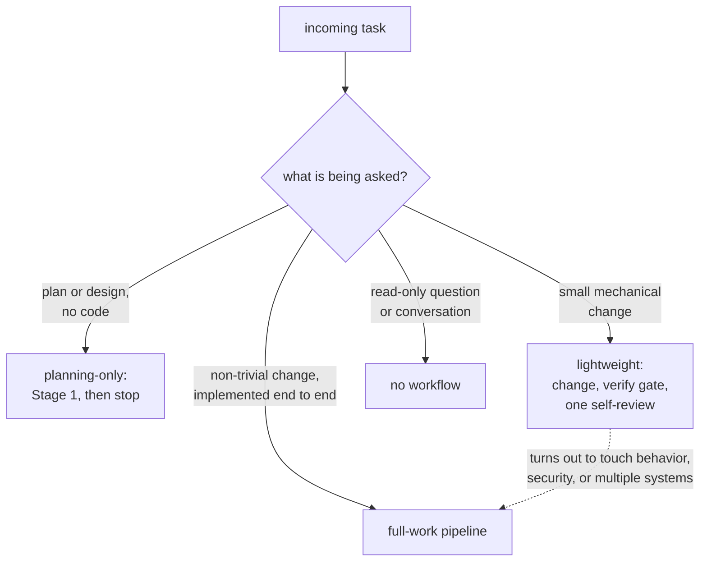
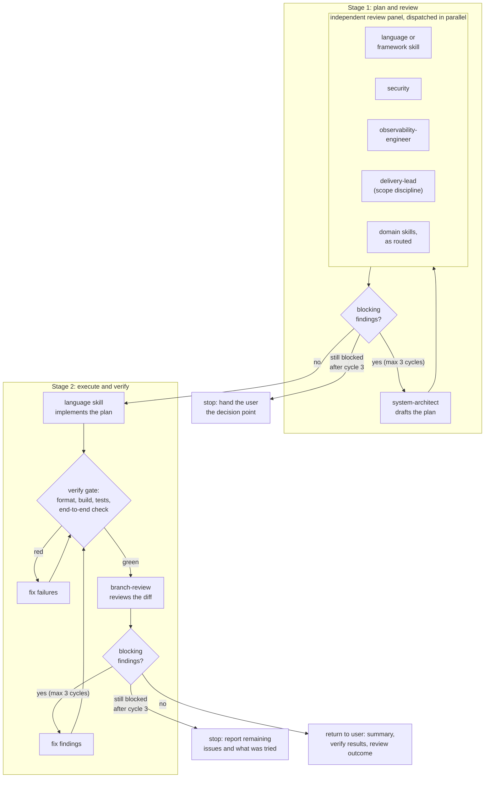
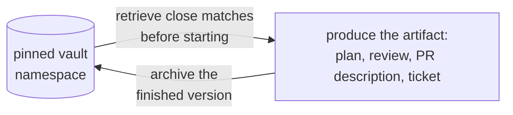

# Claude skill set

My personal skill set for Claude Code: a bootstrap file, a shared knowledge base, a catalog of
per-domain skills, and a set of execution workflows that turn the whole thing into a pipeline. The
skills tell the agent how to write good code in each stack; the workflows decide how a task moves
from prompt to a reviewed, verified result. The workflows are the part you won't find in most skill
collections, so they get the longest section below.

## This is opinionated
...but not unreasonable.

I have preferred setups when working with certain programming languages, like Rust, C#, and Python, and to help keep
code quality, and allow for better, fast collaboration with other humans (and machines), I made a few choices. 
While I admit that they fall into "opinionated" territory, they will probably fit a lot of people setups also.

As a high level, here are some examples:

### Coding in general (regardless of the language)
- Search before writing: before adding any helper, mapper, or constant, the agent looks for an existing
  implementation to reuse or extend. Duplicating logic the repo already has counts as a defect, even
  when the new copy works.
- No deprecated APIs, ever. A deprecation warning on a line the agent touched blocks delivery; it's a
  failure to fix, not noise to scroll past.
- A deliberate change is the source of truth. When it breaks an old test, the test gets updated; the
  agent never reverts the change or relaxes a validation just to go green.
- Minimal diffs with a contained blast radius: solve what was asked, tighten only the thing being
  tightened, leave the rest alone.
- Git stays human. The agent inspects freely (through a read-only MCP) but never stages or commits.
- Pushes the agents to follow Clean Code, best practices, SOLID, etc.

### For C#
- Nullable reference types stay disabled in all projects (which should be the default, IMO), and the
  canonical `.editorconfig` turns a stray `?` annotation into a build error.
- One public type per file, even when neighboring files disagree.
- `init` over `set`: properties are immutable after construction unless mutation is a genuine
  requirement of the flow.
- No Moq, no FluentAssertions. Tests assert with native xUnit `Assert` and replace mocks with small
  hand-rolled fakes.
- No AutoMapper.
- Every test body carries `// Arrange`, `// Act`, `// Assert` and no other comment; a test that seems
  to need more commentary is too clever and gets rewritten.
- No "just in case" defaults (`string.Empty`, `?? string.Empty`), and enum members get explicit values
  starting at 1, so a `0` always means "bug: never assigned".
- Test files mirror the source folder structure instead of piling up at the test project root.

### For Python
- Type hints everywhere, and docstrings (Google or NumPy style) on every public API.
- Done means the toolchain passes: `ruff check`, `ruff format`, `mypy`, and `pytest` with coverage,
  all clean before work is called complete.
- Tests use pytest with Arrange-Act-Assert and mirror the source package layout under `tests/`, never
  dumped flat at the root.
- Pickle-based model weights (`torch.load`, `joblib`) are treated as untrusted code, not data: trusted
  sources only, prefer safetensors, and `weights_only=True` where the call supports it.

### For Rust
- `anyhow` in binaries with `.context(...)` attached at every level; `thiserror` for library crates.
  No `eyre`.
- No `unwrap()` or `expect()` outside test code; errors propagate with `?`.
- `tracing` is the logging crate, with structured fields on events, never `log`/`env_logger` or
  `println!` diagnostics.
- Borrow over clone: `&str` instead of `&String`, `&[T]` instead of `&Vec<T>`.
- The type system does the guarding: enums and newtypes make illegal states unrepresentable, and raw
  input is parsed into typed structures at the boundary.
- `rustfmt` and `clippy` run with the repo's defaults, never tweaked, and every warning gets fixed.

## How it works

Two `CLAUDE.md` files (one at the repo root, one global) tell the agent to read a short list of foundational
knowledge files at the start of every conversation:

1. `general-problem-solving.md`: reasoning and planning approach
2. `general-remembering-lessons.md`: the cross-project lessons vault protocol
3. `git-readonly-operations.md`: how to use the read-only git MCP
4. `task-workflows.md`: the execution workflows described below
5. `vault-operations.md`: when and how to use the vault MCP
6. `os-doctor-operations.md`: local machine diagnostics via the os-doctor MCP
7. `writing-style.md`: how to write prose that doesn't read as AI-generated
8. `machine-privacy.md`: keep machine-identifying details (paths, usernames, hostnames) out of anything durable
9. `text-search-operations.md`: read-only file search, reading, and inspection via the text-search MCP
10. `text-edit-operations.md`: bulk text mutation with journaled undo via the text-edit MCP

Everything else in `skills/brain/knowledge/` is loaded on demand when a task relates to it. Individual
skills are surfaced by the Claude Code runtime and applied when their domain comes up.

## Execution workflows

Defined in `skills/brain/knowledge/task-workflows.md` and applied to every coding task. Instead of the
agent free-styling from prompt to diff, each task is classified before work starts and routed down one
of four paths:

- **Full-work**: any non-trivial change the user wants implemented end to end. Features, behavior
  changes, anything spanning multiple files or touching security, data, external interfaces, or
  migrations.
- **Planning-only**: the user wants a plan or a design decision, not code. Runs Stage 1 of the
  full-work pipeline and stops there.
- **Lightweight**: a small mechanical change (typo, config tweak, doc edit, rename). Skips the review
  panel; the change still passes the verify gate and gets one focused self-review.
- **None**: read-only questions and conversation run no workflow at all.

Classification isn't final. A task that starts lightweight but turns out to touch behavior or multiple
systems escalates to full-work rather than pushing a large change through the light path.



### The full-work pipeline



**Stage 1: plan and review.** The `system-architect` skill turns the prompt into a plan. That plan then
goes to an independent review panel, dispatched in parallel, where each reviewer reads the same plan
through its own lens:

- the relevant language or framework skill, for technical depth
- `security`, reviewing as a security professional
- `observability-engineer`, recommending a sane level of monitoring and logging
- `delivery-lead`, checking the plan against the original prompt for scope creep, gold-plating, and
  speculative work; the one lens that argues for less while the rest pull toward adding
- any domain skill the plan actually touches (`postgres`, `reactjs`, `godot`, and so on), routed by
  what the plan does rather than a fixed list

Findings are consolidated, de-duplicated, and split into **blocking** (correctness, security, data, or
design flaws) and **suggestions**. Blocking findings send the plan back to the architect for revision;
only the lenses whose concerns the revision touched re-review, not the whole panel. Suggestions worth
taking are folded in directly. When the `delivery-lead`'s push to cut collides with a lens asking to add,
correctness, security, and data-safety win; the delivery-lead's counter is to question whether the feature
that needs the hardening belonged in the ask at all.

**Stage 2: execute and verify.** The language skill implements the approved plan. Before any review
happens, a mandatory verify gate runs: formatter, build or typecheck, the test suite, and an end-to-end
exercise of the change where it has a runtime surface. Review never starts on a red build, because
reviewing unrun code is reviewing a guess. Once the gate is green, `branch-review` reviews the diff.
Blocking findings loop back to a fix, another pass through the verify gate, and a re-review of the
affected areas.

**Loop caps.** Both revision loops are capped at 3 cycles. If blocking issues survive the third cycle,
the pipeline stops and hands the user a real decision point: the specific disagreement, what was tried,
and the trade-off at stake. No infinite plan-review ping-pong.

**Autonomy.** The pipeline runs end to end without pausing for approval between stages or narrating
each skill handoff. It comes back when the work is done (with a summary, the verify results, and the
review outcome) or when a cap is hit.

### Precedent through the vault

The workflows have memory. Before a planning stage starts, prior plans are retrieved from the [vault](https://github.com/brenordv/mcp-toolset/tree/master/src/RaccoonNinja.McpToolset.Server.FileVault) and
close matches inform the new one; before a review, prior reviews. Full-work tasks also keep a live
progress checkpoint in the vault (created with the plan, updated at stage boundaries and before risky
steps), so a crash, freeze, or token exhaustion resumes from the checkpoint instead of re-deriving
state. Finished artifacts are archived back,
so every plan, review, PR description, and ticket becomes searchable precedent for the next one. Each
archive lives in a pinned vault namespace so it stays cross-project instead of siloing per repo:

| Vault project          | Filled by                                                                            |
|------------------------|--------------------------------------------------------------------------------------|
| `implementation-plans` | `system-architect` and Stage 1 of the pipeline                                       |
| `code-reviews`         | `branch-review`                                                                      |
| `pr-descriptions`      | `pr-description`                                                                     |
| `ticket-descriptions`  | `ticket-description`                                                                 |
| `lessons`              | cross-project lessons captured automatically per `general-remembering-lessons.md`    |
| `git-ops-backlog`      | capability-gap tickets filed when the git-ops MCP can't do something an agent needed |

Every archive runs the same two-sided loop:



The lessons project is the odd one out: it isn't tied to a workflow stage. Lessons get saved whenever a
correction, gotcha, or durable preference passes a two-part filter (still true in six months, and not
something a competent practitioner does by default), and they're consulted before any plan is produced.

## Skill catalog

| Skill                    | What it covers                                                                                                                                                          |
|--------------------------|-------------------------------------------------------------------------------------------------------------------------------------------------------------------------|
| `csharp`                 | Production C#: formatting, naming, async, DI, xUnit; nullable disabled, one public type per file                                                                        |
| `python`                 | Production Python: PEP 8, type safety, testing                                                                                                                          |
| `rust`                   | Idiomatic Rust: `anyhow`-only error handling, borrow over clone, clippy-clean                                                                                           |
| `angular`                | Angular v17+: Signals, standalone components, zoneless, SSR/hydration, RxJS                                                                                             |
| `reactjs`                | React 19+/TypeScript: hooks, component architecture, state, performance, a11y                                                                                           |
| `nextjs`                 | Next.js App Router: Server/Client Components, Server Actions, deployment                                                                                                |
| `game-developer`         | Game design and system architecture, applied before any game code is written                                                                                            |
| `godot`                  | Godot 4.6.1: GDScript/C#, scenes and nodes, physics, shaders, export                                                                                                    |
| `unity`                  | Unity 6.3: C#, ECS/DOTS, URP/HDRP, Netcode for GameObjects                                                                                                              |
| `unreal-engine`          | Unreal 5.7: C++/Blueprints, Nanite, Lumen, GAS, replication                                                                                                             |
| `postgres`               | PostgreSQL 16+: schema, indexing, query optimization, partitioning, replication                                                                                         |
| `azure-sql-server`       | Azure SQL: T-SQL optimization, security, HA, migrations, IaC                                                                                                            |
| `azure-cosmos`           | Cosmos DB NoSQL: data modeling, polyglot SDKs (Python/Java/TS/Rust)                                                                                                     |
| `nosql-database`         | NoSQL architecture: document, key-value, wide-column, graph, vector; query-first modeling                                                                               |
| `azure-eventhub`         | Event Hubs: high-throughput streaming, polyglot SDKs                                                                                                                    |
| `linux-shell-scripting`  | Production shell-script templates for Linux administration                                                                                                              |
| `linux-troubleshooting`  | A workflow for diagnosing system, performance, and service issues                                                                                                       |
| `observability-engineer` | Monitoring, logging, tracing; SLI/SLO management; incident response                                                                                                     |
| `system-architect`       | Architecture planning: ADRs, C4 diagrams, roadmaps. Never writes implementation code                                                                                    |
| `security`               | Security and pentest entry point: SAST, dependency scanning, compliance, threat modeling                                                                                |
| `branch-review`          | Reviews the current branch against main across correctness, security, performance, maintainability, testing; also checks prose style and blocks on machine-detail leaks |
| `delivery-lead`          | Scope-discipline lens on a drafted plan: flags scope creep, gold-plating, speculative work, and problems the ask never raised; the review panel's one voice for less        |
| `pr-description`         | Generates a PR description in the house format from the diff; retrieves precedent and archives it                                                                       |
| `ticket-description`     | Drafts a ticket title and description from a branch or via Q&A; retrieves precedent and archives it                                                                     |
| `theme-factory`          | Styling toolkit for artifacts, with preset themes                                                                                                                       |

## The knowledge layer

`skills/brain/knowledge/` holds the shared, language-agnostic guidance every skill builds on. Beyond the
ten always-on files listed above, it covers general coding conventions, testing, code review and its
heuristic checklist, GitHub PR stacks (detection, plus layer-by-layer review and PR-description
rules), the shared MCP operations protocol (capability-gap tickets, dispatch restatements),
game-dev coding, databases, DevOps operations, security, and how to author skill rules that
stick. These load on demand
when a task touches their topic.

Traps already hit live as lessons in the vault MCP (the pinned `lessons` project described above),
consulted before planning and during reviews so the same trap isn't hit twice.

## Enforcement hooks

`hooks/` (at the repo root) holds optional Claude Code `PreToolUse` hooks that enforce the shell rules
the knowledge files describe, so they hold even when a reflex fires before the rule is salient (a fresh
chat, a long context, deep in a task). A knowledge rule is a nudge the model can forget mid-task; a
hook intercepts the tool call and does not depend on recall. Four are included, each shipped as a Windows
`.ps1` and a POSIX `.sh` with identical behavior, each failing open so a fault never blocks a legitimate
command:

- **route-to-text-tools** denies shell commands that read or search files, rewrite files in place, or
  inspect a repo read-only through `git`, and points the agent at the `text-search`, `text-edit`, and
  `git-ops` MCPs instead.
- **block-secrets** hard-blocks shell commands that read or copy secret-looking files (`.env`,
  `secrets.*`, `*.key`, and the like).
- **guard-file-targets** hard-blocks native `Glob`/`Grep`/`Read` calls that target a secret-looking
  file, so a secret can't be located or read by stepping around the shell hooks.
- **block-vcs-writes** hard-blocks the git writes the user owns (`commit`, `add`, `stash`) and every
  `gh stack` subcommand except `view`, enforcing the hands-off-git rule and the PR-stack Hard Rules.

They are opt-in machine config, not auto-loaded like the knowledge files: copy the script for your OS
into `~/.claude/hooks/` and register it under `hooks.PreToolUse` in your settings. They need only a
stock interpreter (`powershell.exe` on Windows; `bash` plus `perl` on macOS/Linux), nothing to install.
`hooks/README.md` has the per-OS install, the exact block and allow behavior, and tuning.

For setting up a hardened global config from scratch (an MCP allow list and secret deny list, the
enforcement hooks, dangerous-command blocks, the non-functional keys to avoid, and an optional
sandbox), see [`security-hardening.md`](security-hardening.md).

## Repo lint

The rulebase checks itself: `tools/lint-repo.sh` (and its `.ps1` twin) verifies that relative links
and cross-file references resolve, and that the prose obeys its own em-dash and machine-privacy
bans. CI runs both implementations on every push and PR (`.github/workflows/repo-lint.yml`), the
`.sh` on Linux and the `.ps1` on Windows, so an OS quirk or a drift between the two hand-synced
scripts fails one job while the other passes. Agents run the lint after editing markdown here.
[`tools/README.md`](tools/README.md) has the what and the why.

## MCP dependencies

Three custom MCP servers back parts of this set:

1. OS-Doctor: https://github.com/brenordv/mcp-os-doctor
2. File Vault: https://github.com/brenordv/mcp-toolset/tree/master/src/RaccoonNinja.McpToolset.Server.FileVault
3. Git Ops: https://github.com/brenordv/mcp-toolset/tree/master/src/RaccoonNinja.McpToolset.Server.GitOps
4. Text Search: https://github.com/brenordv/mcp-toolset/tree/master/src/RaccoonNinja.McpToolset.Server.TextSearch
5. Text Edit: https://github.com/brenordv/mcp-toolset/tree/master/src/RaccoonNinja.McpToolset.Server.TextEdit

> [!NOTE]
> With the exception of OS-Doctor, all other MCP servers live in [a single repo](https://github.com/brenordv/mcp-toolset), and are all cross-platform.


> The vault and git-ops servers are cross-platform. OS-Doctor is Windows-only and used only on my personal
> machine. The skills degrade gracefully without a given server, but the vault-backed precedent archives
> above need the File Vault server to do anything.

## Layout

```
CLAUDE.md                     # bootstrap: what to read at the start of every conversation
hooks/                        # optional PreToolUse hooks that enforce the shell rules (ps1 + sh)
tools/                        # repo lint (ps1 + sh) run by CI and by agents after md edits
skills/
├── brain/
│   └── knowledge/            # shared, always-on and on-demand guidance, incl. task-workflows.md
├── <language/domain skills>/ # each has a SKILL.md, some add references/ or guideline files
└── ...
```

## Using it

Point Claude Code at this repo (or deploy `skills/` and `CLAUDE.md` into your `~/.claude/` setup). The root
`CLAUDE.md` bootstraps the knowledge base per project; the global one applies everywhere. The repo is the
source of truth; deploying it to the global location is a manual step.

## Making things easier with Claude Code

To speed things up, you can allow the agents to read the Knowledge files without asking you for permissions all the time,
by updating the `.claude/settings.json` file:
```json
{
  "permissions": {
    "allow": [
      "Read(~/.claude/skills/brain/**)"
    ]
  }    
}
```