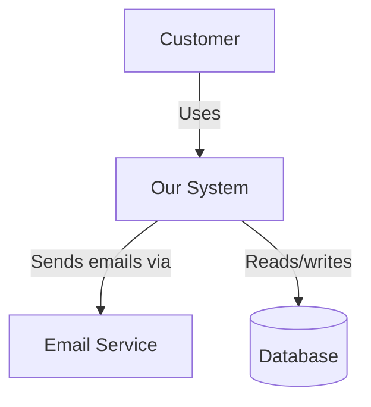
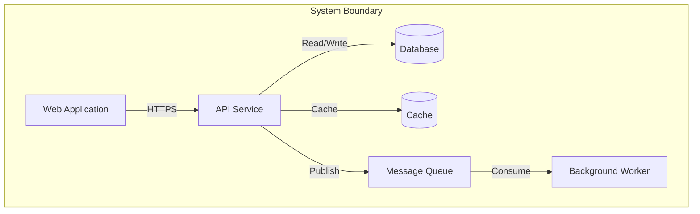
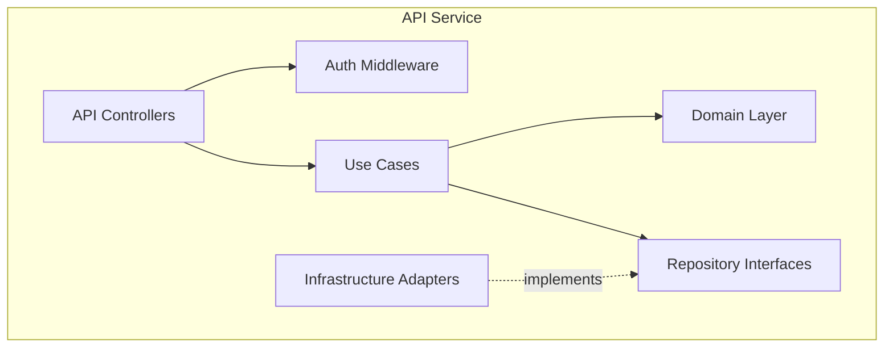

# C4 Model Diagram Examples

Always produce diagrams in Mermaid syntax.

## Level 1: System Context

```mermaid
graph TB
    User[Customer] -->|Uses| System[Our System]
    System -->|Sends emails via| Email[Email Service]
    System -->|Reads/writes| DB[(Database)]
```

## Level 2: Container Diagram

```mermaid
graph TB
    subgraph System Boundary
        WebApp[Web Application]
        API[API Service]
        Worker[Background Worker]
        DB[(Database)]
        Cache[(Cache)]
        Queue[Message Queue]
    end
    WebApp -->|HTTPS| API
    API -->|Read/Write| DB
    API -->|Cache| Cache
    API -->|Publish| Queue
    Queue -->|Consume| Worker
```

## Level 3: Component Diagram

```mermaid
graph TB
    subgraph API Service
        Controller[API Controllers]
        Auth[Auth Middleware]
        UseCases[Use Cases]
        Domain[Domain Layer]
        Repos[Repository Interfaces]
        Adapters[Infrastructure Adapters]
    end
    Controller --> Auth
    Controller --> UseCases
    UseCases --> Domain
    UseCases --> Repos
    Adapters -.implements.-> Repos
```
